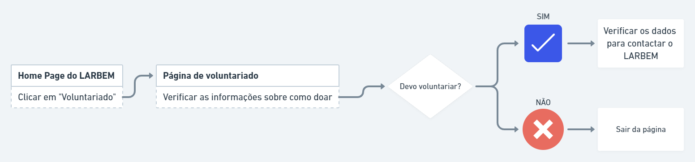
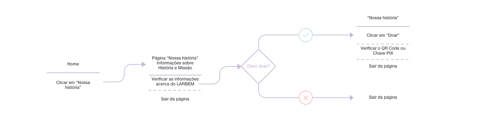

# Projeto de Interface

Pré-requisitos: <a href="02-Especificação do Projeto.md"> Documentação de Especificação</a>

Por meio de um Navegador, os usuários **Interessado em conhecer o LARBEM**, **Doador** e **Voluntário** acessarão a página principal da instituição (Tela 1) informando a URL que requisitará ao servidor web Repl.It os arquivos HTML, CSS, JavaScript e .jpg que compõem a home do site. Em destaque, eles terão acesso à missão do LARBEM e a um resumo do trabalho realizado pela instituição.

Para o percurso do usuário **Interessado em Conhecer o LARBEM**, também estará em destaque o botão para a página Doe (Tela 2), para que conheça as formas de doar caso já esteja convencido de que a missão e os valores da instituição estão em consonância com os seus.

A página principal também disponibilizará o botão de acesso à página Nossa História (Tela 3), para que o usuário **Interessado em conhecer o LARBEM** prossiga em sua busca por avaliar se a instituição tem credibilidade para receber sua doação. Além de contar as décadas da instituição, essa página apresentará a direção do LARBEM em um vídeo de convite a ajudar no trabalho realizado. A página também exibirá um botão para acesso à página Doe (Tela 2), como chamado à ação de doação.

O usuário **Doador**, que já conhece o LARBEM, acessará a página principal (Tela 1) e, a partir dela, a página Transparência (Tela 4), para se informar sobre as ações que o LARBEM tem realizado com os recursos das doações. Nesta página, além dos documentos que mostram como o LARBEM tem utilizado seus recursos, ele encontrará um novo chamado para a página Doe (Tela 2), na qual poderá conferir novamente as informações bancárias e necessidades de materiais para realizar uma nova doação.

Por fim, o usuário **Voluntário** acessará a página principal do LARBEM (Tela 1) para conhecer a missão da instituição e, a partir dela, buscará a página Voluntariado (Tela 5), com a qual vai entender quais são as necessidades de trabalho voluntário do lar de acolhimento.

Em caso de dúvidas sobre as informações apresentadas, todos os usuários terão acesso às informações de contato do LARBEM no pé da página de todas as telas. Além disso, poderão acessar essas informações de forma destacada na página Contato (Tela 6).

## User Flow

## User Flow do Interessado em voluntariar

## User Flow do Interessado em conhecer/doar

Fluxo de usuário (User Flow) é uma técnica que permite ao desenvolvedor mapear todo fluxo de telas do site ou app. Essa técnica funciona para alinhar os caminhos e as possíveis ações que o usuário pode fazer junto com os membros de sua equipe.

> **Links Úteis**:
> - [User Flow: O Quê É e Como Fazer?](https://medium.com/7bits/fluxo-de-usu%C3%A1rio-user-flow-o-que-%C3%A9-como-fazer-79d965872534)
> - [User Flow vs Site Maps](http://designr.com.br/sitemap-e-user-flow-quais-as-diferencas-e-quando-usar-cada-um/)
> - [Top 25 User Flow Tools & Templates for Smooth](https://www.mockplus.com/blog/post/user-flow-tools)

## Wireframes

## Wireframe - Página HOME

## Wireframe - Página Nossa História

## Wireframe - Página DOE

## Wireframe - Página VOLUNTARIADO

## Wireframe - Página Transparência

São protótipos usados em design de interface para sugerir a estrutura de um site web e seu relacionamentos entre suas páginas. Um wireframe web é uma ilustração semelhante do layout de elementos fundamentais na interface.
 
> **Links Úteis**:
> - [Protótipos vs Wireframes](https://www.nngroup.com/videos/prototypes-vs-wireframes-ux-projects/)
> - [Ferramentas de Wireframes](https://rockcontent.com/blog/wireframes/)
> - [MarvelApp](https://marvelapp.com/developers/documentation/tutorials/)
> - [Figma](https://www.figma.com/)
> - [Adobe XD](https://www.adobe.com/br/products/xd.html#scroll)
> - [Axure](https://www.axure.com/edu) (Licença Educacional)
> - [InvisionApp](https://www.invisionapp.com/) (Licença Educacional)
