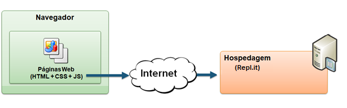

# Arquitetura da Solução

Pré-requisitos: <a href="04-Projeto de Interface.md"> Projeto de Interface</a>

A arquitetura da solução proposta para o site do LARBEM conta com o servidor Web Heroku para atender às requisições do navegador utilizado pelo usuário e apresentar as páginas programadas nas linguaguens HTML5, CCS e JavaScript, além de arquivos de imagens (.jpg). A página contará também com posts incorporados de redes sociais e vídeos incorporados do YouTube e terá como conteúdo informações sobre a instituição e as formas de ajudá-la, além de meios de contato por telefone, endereço, e-mail e redes sociais do LARBEM. 

O usuário acessará a home do LARBEM por meio da URL (*ainda a definir*). Através da página principal, terá acesso a outras cinco páginas apresentadas em um menu superior e em botões distribuídos ao longo da página. Cada uma dessas páginas também poderá ser acessada diretamente informando o caminho após o host na URL. 

**- Home do LARBEM**: apresentará com destaque a missão da instituição, o trabalho realizado, sua equipe e suas redes sociais, além de informações básicas como endereço e contatos no pé da página. Terá links para todas as outras páginas por meio de um menu e botões.
  - **Doe**: Terá as informações de contas bancárias e chave pix do LARBEM, além de materiais que a instituição utiliza de forma recorrente e podem ser doados;
  - **Nossa História**: Contará a história do LARBEM; 
  - **Voluntariado**: Apresentará as possibilidades de atuação como voluntário do LARBEM bem como o compromisso necessário para tal, além de histórias de atuais voluntários;
  - **Contato**: exibirá telefones, e-mail, endereço e redes sociais do LARBEM de forma destacada;
  - **Transparência**: exibirá balanços de gastos do LARBEM, certificações, documentações e expediente completo da instituição. 

## Diagrama de componentes

Os componentes que fazem parte da solução são apresentados na Figura 01.

Figura 01 - Arquitetura da Solução

A solução implementada conta com os seguintes módulos:
- **Navegador** - Interface básica do sistema  
  - **Páginas Web** - Conjunto de arquivos HTML, CSS, JavaScript e imagens que implementam as funcionalidades do sistema.
 - **Hospedagem** - local na Internet onde as páginas são mantidas e acessadas pelo navegador. 

O site do LARBEM não terá formas de login ou cadastro para os usuários e apresentará de forma acessível e direta as informações básicas para conhecer e ajudar as instituição, como um cartão de visitas. Devido a isso, não serão necessários bancos de dados, já que também não haverá espaços de comentários ou atualização de notícias. 

Por meio de um Navegador, os usuários **Interessado em conhecer o LARBEM**, **Doador** e **Voluntário** acessarão a página principal da instituição (Tela 1) informando a URL que requisitará ao servidor web Heroku os arquivos HTML, CSS, JavaScript e .jpg que compõem a home do site. Em destaque, eles terão acesso à missão do LARBEM e a um resumo do trabalho realizado pela instituição. 

Para o percurso do usuário **Interessado em Conhecer o LARBEM**, também estará em destaque o botão para a página *Doe* (Tela 2), para que conheça as formas de doar caso já esteja convencido de que a missão e os valores da instituição estão em consonância com os seus.

A página principal também disponibilizará o botão de acesso à página *Nossa História* (Tela 3), para que o usuário **Interessado em conhecer o LARBEM** prossiga em sua busca por avaliar se a instituição tem credibilidade para receber sua doação. Além de contar as décadas da instituição, essa página apresentará a direção do LARBEM em um vídeo de convite a ajudar no trabalho realizado. A página também exibirá um botão para acesso à página *Doe* (Tela 2), como chamado à ação de doação.

O usuário **Doador**, que já conhece o LARBEM, acessará a página principal (Tela 1) e, a partir dela, a página *Transparência* (Tela 4), para se informar sobre as ações que o LARBEM tem realizado com os recursos das doações. Nesta página, além dos documentos que mostram como o LARBEM tem utilizado seus recursos, ele encontrará um novo chamado para a página *Doe* (Tela 2), na qual poderá conferir novamente as informações bancárias e necessidades de materiais para realizar uma nova doação.

Por fim, o usuário **Voluntário** acessará a página principal do LARBEM (Tela 1) para conhecer a missão da instituição e, a partir dela, buscará a página *Voluntariado* (Tela 5), com a qual vai entender quais são as necessidades de trabalho voluntário do lar de acolhimento. 

Em caso de dúvidas sobre as informações apresentadas, todos os usuários terão acesso às informações de contato do LARBEM no pé da página de todas as telas. Além disso, poderão acessar essas informações de forma destacada na página *Contato* (Tela 6). 

## Tecnologias Utilizadas

Na construção do site serão usadas as linguagens html, css e javascript por serem as mais indicadas para construção de sites web. A IDE de desenvolvimento escolhida pela equipe foi o REPLIT por ser gratuito e apresentar ferramentas que facilitam o trabalho colaborativo em equipe e já permitir a criação e hospedagem do site através dele, facilitando o trabalho da equipe que ainda está no início do aprendizado em computação. Será utilizada a biblioteca Jquery para manipular eventos de clicks em botões e criar alteração do layout de forma dinâmica. A equipe também pretende utilizar o framework bootstrap já que uma o principal requisito não funcional do site é que o mesmo será otimizado para celular (Mobile-First).  

Descreva aqui qual(is) tecnologias você vai usar para resolver o seu problema, ou seja, implementar a sua solução. Liste todas as tecnologias envolvidas, linguagens a serem utilizadas, serviços web, frameworks, bibliotecas, IDEs de desenvolvimento, e ferramentas.

Apresente também uma figura explicando como as tecnologias estão relacionadas ou como uma interação do usuário com o sistema vai ser conduzida, por onde ela passa até retornar uma resposta ao usuário.

## Hospedagem

Explique como a hospedagem e o lançamento da plataforma foi feita.

Utilizaremos o Replit para hospedagem, já que essa plataforma oferece ferramentas automatizadas para dar deploy no futuro site do LARBEM. 

> **Links Úteis**:
>
> - [Website com GitHub Pages](https://pages.github.com/)
> - [Programação colaborativa com Repl.it](https://repl.it/)
> - [Getting Started with Heroku](https://devcenter.heroku.com/start)
> - [Publicando Seu Site No Heroku](http://pythonclub.com.br/publicando-seu-hello-world-no-heroku.html)
