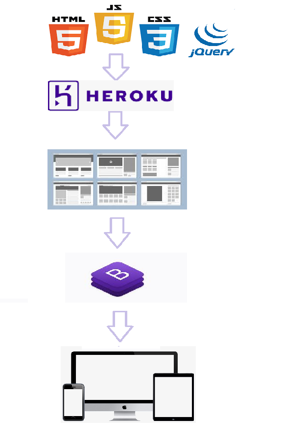

# Arquitetura da Solução

Pré-requisitos: <a href="04-Projeto de Interface.md"> Projeto de Interface</a>

A arquitetura da solução proposta para o site do LARBEM conta com o servidor Web Repl.it para atender às requisições do navegador utilizado pelo usuário e apresentar as páginas programadas nas linguaguens HTML5, CCS e JavaScript, além de arquivos de imagens (.jpg). A página contará também com posts incorporados de redes sociais e vídeos incorporados do YouTube e terá como conteúdo informações sobre a instituição e as formas de ajudá-la, além de meios de contato por telefone, endereço, e-mail e redes sociais do LARBEM. 

O usuário acessará a home do LARBEM por meio da URL (**https://site-larbem.herokuapp.com/index.html**). Através da página principal, terá acesso a outras cinco páginas apresentadas em um menu superior e em botões distribuídos ao longo da página. Cada uma dessas páginas também poderá ser acessada diretamente informando o caminho após o host na URL. 

**- Home do LARBEM**: apresentará com destaque a missão da instituição, o trabalho realizado, sua equipe e suas redes sociais, além de informações básicas como endereço e contatos no pé da página. Terá links para todas as outras páginas por meio de um menu e botões.
  - **Doe**: Terá as informações de contas bancárias e chave pix do LARBEM, além de materiais que a instituição utiliza de forma recorrente e podem ser doados;
  - **Nossa História**: Contará a história do LARBEM; 
  - **Voluntariado**: Apresentará as possibilidades de atuação como voluntário do LARBEM bem como o compromisso necessário para tal, além de histórias de atuais voluntários;
  - **Contato**: exibirá telefones, e-mail, endereço e redes sociais do LARBEM de forma destacada;
  - **Transparência**: exibirá balanços de gastos do LARBEM, certificações, documentações e expediente completo da instituição. 

## Diagrama de componentes

Os componentes que fazem parte da solução são apresentados na Figura 01.

Figura 01 - Arquitetura da Solução

A solução implementada conta com os seguintes módulos:
- **Navegador** - Interface básica do sistema  
  - **Páginas Web** - Conjunto de arquivos HTML, CSS, JavaScript e imagens que implementam as funcionalidades do sistema.
 - **Hospedagem** - local na Internet onde as páginas são mantidas e acessadas pelo navegador. 

O site do LARBEM não terá formas de login ou cadastro para os usuários e apresentará de forma acessível e direta as informações básicas para conhecer e ajudar as instituição, como um cartão de visitas. Devido a isso, não serão necessários bancos de dados, já que também não haverá espaços de comentários ou atualização de notícias.

## Tecnologias Utilizadas

Na construção do site serão usadas as linguagens html, css e javascript por serem as mais indicadas para construção de sites web. A IDE de desenvolvimento escolhida pela equipe foi o REPLIT(Optou-se pelo Heroku como substituto ao Replit devido a problemas de compatibilidade e desenvolvimento do site) por ser gratuito e apresentar ferramentas que facilitam o trabalho colaborativo em equipe e já permitir a criação e hospedagem do site através dele, facilitando o trabalho da equipe que ainda está no início do aprendizado em computação. Será utilizada a biblioteca Jquery para manipular eventos de clicks em botões e criar alteração do layout de forma dinâmica. A equipe também pretende utilizar o framework bootstrap já que o principal requisito não funcional do site é que o mesmo será otimizado para celular (Mobile-First).  

Figura 02 - Tecnologias Utilizadas

## Hospedagem

Utilizaremos o Replit (Optou-se pelo Heroku como substituto ao Replit devido a problemas de compatibilidade e desenvolvimento do site) para hospedagem, já que essa plataforma oferece ferramentas automatizadas para dar deploy no futuro site do LARBEM. O novo site pode ser acessado pela seguinte URL: **https://site-larbem.herokuapp.com/index.html**.

