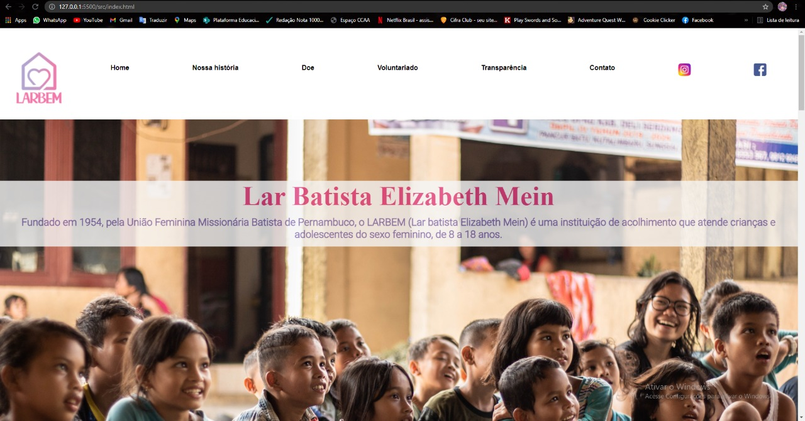
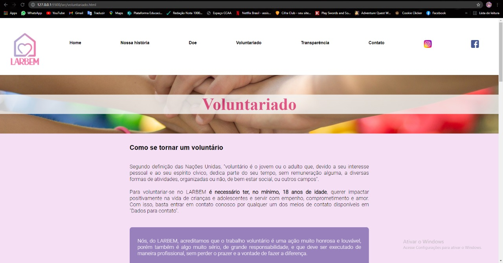
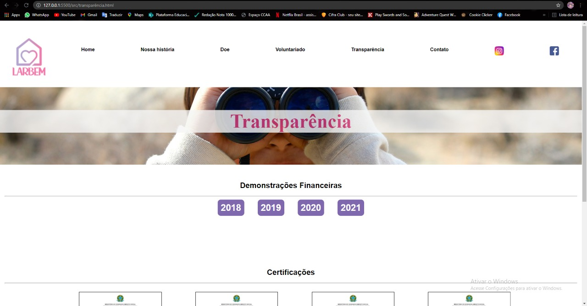
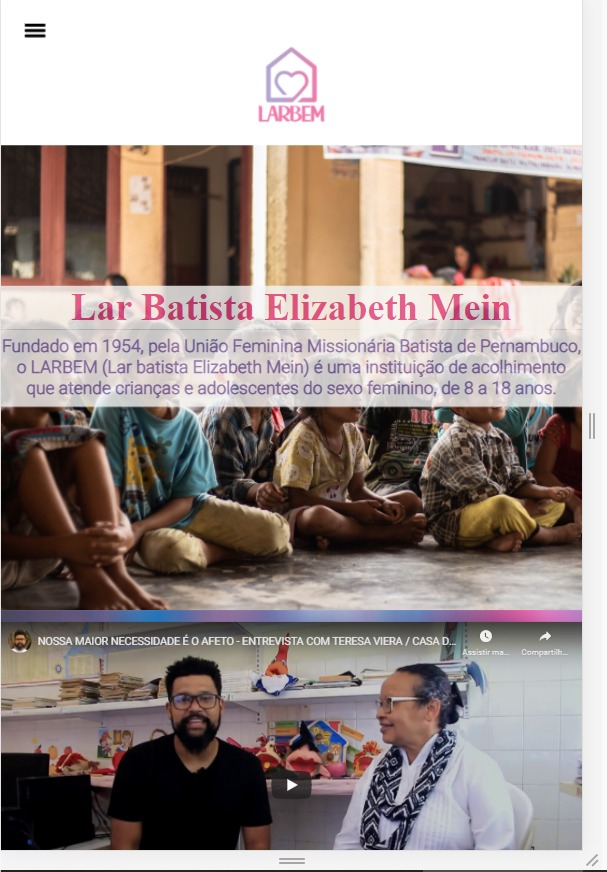

# Registro de Testes de Software

Pré-requisitos: <a href="3-Projeto de Interface.md"> Projeto de Interface</a>, <a href="8-Plano de Testes de Software.md"> Plano de Testes de Software</a>

Pré-requisitos: 
Computador com acesso à internet; 
navegador com versão compatível com tecnologia html5

CT.01 - Acesso às páginas home e nossa história

Procedimentos:
1.	Acessar o site através do link;
2.	Clicar na página Nossa História no menu superior.

Resultados obtidos:
1.	Ao acessar o link do site a página home é aberta, apresentando as principais informações da organização.
2.	Ao clicar no botão Nossa história a tela carrega os dados sobre a história do LARBEM (apresentação em formato linha do tempo)

CT.02 - Acesso as informações sobre voluntariado

Procedimentos:
1.	Acessar o site através do link;
2.	Clicar na página Voluntariado no menu superior.

Resultados obtidos:
1.	Ao acessar o link do site a página home é aberta, apresentando as principais informações da organização.
2.	Ao clicar no botão Voluntariado a tela mostra a lista de vagas de voluntariado que o LARBEM necessita e informações de contato para se candidatar a essas vagas ou para enviar proposta de um algum outro tipo de trabalho voluntário.

CT.03 - Acesso aos dados financeiros de transparência do LARBEM (prestação de contas)

Procedimentos:
1.	Acessar o site através do link;
2.	Clicar na página Transparência no menu superior;
3.	Clicar no botão correspondente ao ano da prestação de contas que o usuário deseja visualizar.

Resultados obtidos:
1.	Ao acessar o link do site a página home é aberta, apresentando as principais informações da organização.
2.	Ao clicar no Transparência são apresentados botões correspondentes aos anos 2018, 2019, 2020 e 2021.
3.	Ao clicar no botão a tela abre o arquivo .pdf com o documento de prestação de contas correspondente em uma nova guia.

CT.04 - Acesso a dados bancários para realizar doação

Procedimentos:
1.	Acessar o site através do link;
2.	Clicar na página Doe.

Resultados obtidos:
1.	Ao acessar o link do site a página home é aberta, apresentando as principais informações da organização.
2.	Ao clicar em Doe é carregado a tela com todos os dados bancários do LARBEM para doação.

CT.05 - Validar estrutura Mobile-First do site

Procedimentos:
1.	Acessar o site através do link utilizando computador;
2.	Acessar o site através do link utilizando smartphone.

Resultados obtidos:
1.	Ao acessar o link do site a página home é aberta, apresentando as principais informações da organização.
2.	Ao acessar o link do site a página home é aberta, apresentando as principais informações da organização, porém com o layout do site adaptado automaticamente de acordo com o aparelho utilizado para acesso.

## Avaliação

Dentro de todos os cenários de testes propostos no "Plano de testes de software" todos foram realizados com êxito em mais um navegador e tanto po aparelhos mobiles quanto por computadores e notebooks. 
Os navegadores usados para teste foram: Google Chrome, Mozilla Firefox e Safari.

> **Links Úteis**:
> - [Ferramentas de Test para Java Script](https://geekflare.com/javascript-unit-testing/)
